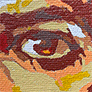
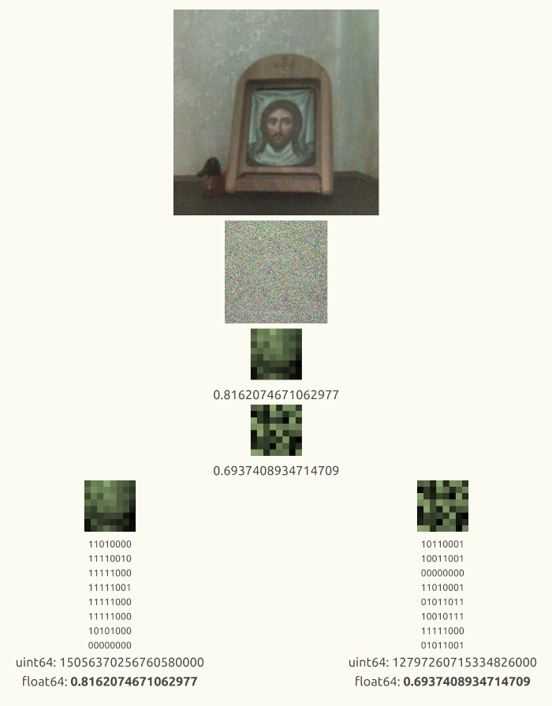
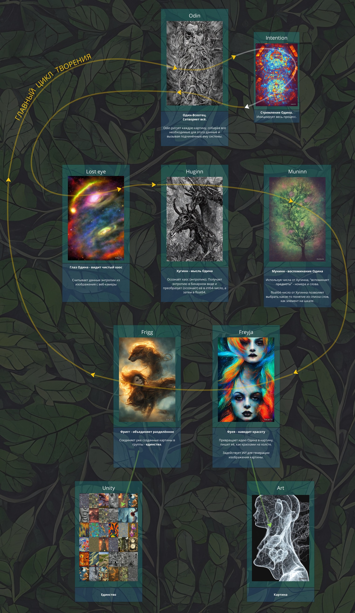
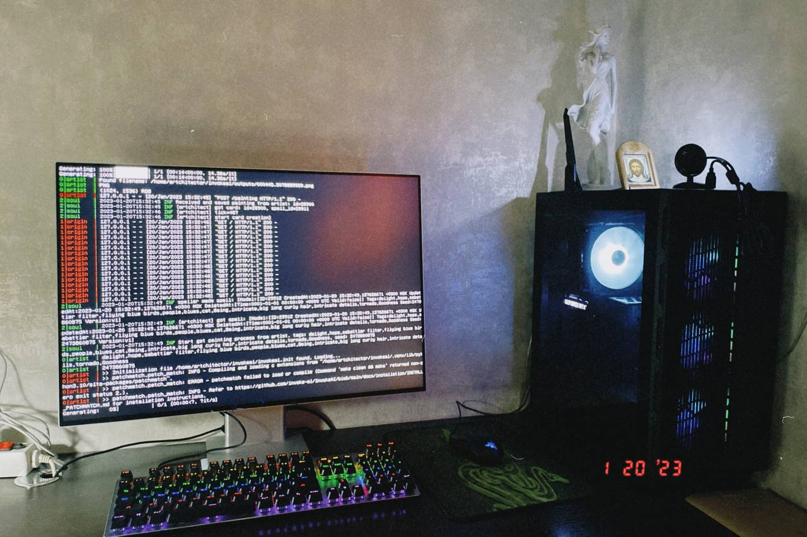

# Artchitect

#### https://artchitect.space

> Artchitect (или Архитектор) - это удивительная автономная творческая машина, способная создавать великолепные
> картины,
> вдохновляясь окружающей нас Вселенной. В своем непрерывном творчестве машина черпает вдохновение из естественной
> энтропии
> Вселенной, представленной в виде фонового света, и создает уникальные произведения без участия человека.

### Алгоритм преобразования энтропии (света) в число

### Архитектура программного кода

> Если код не читается, как приключенческая книга - его никто не захочет читать.

Код artchitect написан в духе скандинавской мифологии. Картины сотворяет верховный бог 
[Асгарда](services/asgard/) - 
[Odin](services/asgard/pantheon/odin.go)
, ему помогают его 
верные [Huginn](services/asgard/pantheon/huginn.go), [Muninn](services/asgard/pantheon/muninn.go), 
и [многие другие](services/asgard/pantheon).

#### Главный цикл творения

#### Рабочий стенд Artchitect
Stable Diffusion AI v1.5 работает на Nvidia RTX 3060 12Gb.
